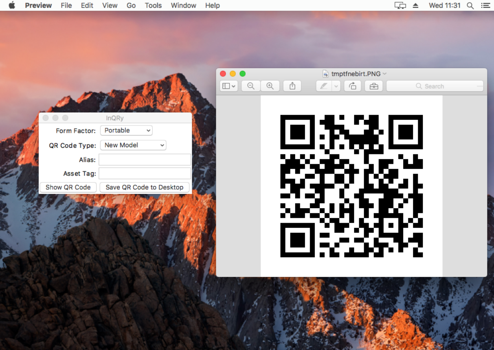

# InQRy

A robust, cross-platform utility that generates a QR code containing hardware specs of the target machine or device.

- [About](#about)
- [Supported platforms](#supported-platforms)
- [Installing and running](#installing-and-running)
- [Building from source](#building-from-source)
    - [macOS](#macos)
    - [Windows](#windows)
- [How it works](#how-it-works)
- [Usage](#usage)
- [Screenshot](#screenshot)
- [Limitations](#limitations)
- [Issue submission](#issue-submission)

### Supported platforms
- OS X 10.10 or later
- Windows 10
- Windows Server 2012 R2

## About
Written in pure Python, InQRy is designed to obtain asset information both quickly and accurately, without
having to rely on data imports or asset-owner participation during physical inventory. The QR code contains detailed
information about the client machine or device, which can then be scanned to quickly add the asset into a web-based
inventory system, such as [Snipe-IT](https://github.com/snipe/snipe-it).

Though originally designed to work on only laptop and desktop computers, it is now capable of
obtaining the hardware specs of any number of attached iOS devices, pending that Apple's command-line utility
[`cfgutil`](https://www.k12techsystems.com/2015/10/cfgutil-missing-man-page/) is installed via
[Apple Configurator 2](https://itunes.apple.com/us/app/apple-configurator-2/id1037126344?mt=12).

## Installing and running

    $ pip install inqry
    $ python -m inqry

## Building from source
### macOS
#### Requirements
- OS X 10.10 or later 
- [Homebrew](https://brew.sh/)-installed version of Python 3.4 or later
- Xcode Command Line Tools
- `py2app>=0.12`

#### Instructions
    $ python setup.py py2app --iconfile icon/inqry.icns
- **InQRy.app** is in `dist/`

### Windows
#### Requirements
- Windows 10
- Python 3.4 or Python 3.5
- `pyinstaller>=3.2.1`

#### Instructions
    $ pyinstaller --onefile --icon icon/inqry.ico inqry
- **InQRy.exe** is in `dist/`

## How it works

InQRy obtains hardware specs using platform-specific shell commands and Python modules. Data is parsed and 
given to `SystemSpecs` object, where it is homogenized and passed to the `FormInstructions` class, where even more data
is added and manipulated to work with the [Snipe-IT](https://github.com/snipe/snipe-it) inventory system. Instructions
containing that data are used to create a [python-qrcode](https://github.com/lincolnloop/python-qrcode)-generated code,
which is displayed on the screen for scanning.

InQRy determines which instructions to follow based on a combination of user input and the machine itself. Those
instructions contain other important information that allow it to move fluidly through different types of fields
in the [Snipe-IT](https://github.com/snipe/snipe-it) asset entry form.

### Usage:
Example usage of an InQRy `SystemSpecs` object:

    >>> from inqry.system_specs import systemspecs
    >>> ss = systemspecs.SystemSpecs()
    >>> ss.os_type
    'Darwin'
    >>> ss.memory
    '8 GB'
    >>> ss.storage
    {'Drive 1': '251.0 GB SSD (APPLE SSD AP0256J)'}

### Screenshot

### Limitations
- The CR1400 series QR code reader is required to use the QR code with an entry form.
See the [barcode scanner README](docs/QRreader-config/README.md) for more information.

- Provided you have a working barcode scanner, the `FormInstructions` class is written to work _only_ with our own
[custom fields](https://snipe-it.readme.io/v3.6.2/docs/custom-fields) in our instance of Snipe-IT. 
The `FormInstructions` class would need to be modified to use in your own Snipe-IT environment or inventory system.
However, most of its attributes should be completely capable of working with other types of asset-entry forms.

- Obtaining mobile device hardware specs is limited to iOS devices, and contigent upon having installed `cfgutil` via
[Apple Configurator 2](https://itunes.apple.com/us/app/apple-configurator-2/id1037126344?mt=12).

## Issues
- Create a [GitHub Issue](https://github.com/Microsoft/InQRy/issues/new)
- [apxlab@microsoft.com](mailto:apxlab@microsoft.com)

##### Microsoft Internal Only:
- Submit a bug on our VSTS board: [aka.ms/hubenglabsr](https://office.visualstudio.com/DefaultCollection/APEX/Lab-Support/_dashboards?activeDashboardId=88948f37-eb9b-4b40-a59a-b615aff02d4d)

